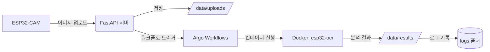

# ESP32-CAM Parking OCR Pipeline  
> FastAPI + Argo Workflows + Docker + EasyOCR 기반 자동차 위치 인식 파이프라인

---

## 🧭 Overview

이 프로젝트는 **ESP32-CAM**에서 촬영한 이미지를 자동으로 처리하여  
**주차 위치(기둥 번호 등)를 인식**하는 로컬 MLOps 파이프라인이다.

전체 흐름은 다음과 같다:

ESP32-CAM → FastAPI 서버 → Argo Workflow → Docker(OCR 컨테이너) → 결과 JSON
---

## ⚙️ System Architecture



📂 Folder Structure
```
| 폴더 / 파일           | 설명                                                |
| ----------------- | ------------------------------------------------- |
| **app/**          | FastAPI 서버 코드 (이미지 업로드, 워크플로 트리거)                 |
| **argo/**         | Argo Workflow 정의 파일 (`image-process-auto.yaml` 등) |
| **docker/**       | Dockerfile 및 `process_image.py` (EasyOCR 실행)      |
| **logs/**         | 실행 로그 및 결과 요약 저장 위치                               |
| **test_images/**  | 로컬 테스트용 이미지 샘플                                    |
| **watch_folder/** | 폴더 감시 스크립트 (신규 파일 자동 감지 및 워크플로 실행)                |
| **esp32-ocr.tar** | 빌드된 Docker 이미지 (`esp32-ocr:latest`) 압축 파일         |
| **run_all.sh**    | 전체 환경 초기화 및 백그라운드 실행 스크립트                         |
| **run_test.sh**   | 단일 워크플로 수동 테스트 스크립트                               |
| **README.md**     | 프로젝트 설명 문서 (현재 파일)                                |
```

🚀 Quick Start

1️⃣ 사전 설치

WSL2 또는 Raspberry Pi 환경에서 진행 가능
```bash
sudo apt update
sudo apt install -y docker.io kubectl minikube python3-pip
pip install fastapi uvicorn easyocr
```
2️⃣ Minikube 클러스터 시작
```bash
minikube start --driver=docker
kubectl create namespace argo
```
3️⃣ Argo Workflows 설치
```bash
kubectl apply -n argo -f https://github.com/argoproj/argo-workflows/releases/latest/download/install.yaml
```
4️⃣ Docker 이미지 빌드 및 로드
(1) 로컬에서 빌드
```bash
cd docker
docker build -t esp32-ocr:latest .
```
(2) Minikube 내부로 이미지 적재
```bash
eval $(minikube docker-env)
docker load -i ../esp32-ocr.tar     # 또는 직접 빌드
minikube image load esp32-ocr:latest
eval $(minikube docker-env -u)
```
5️⃣ FastAPI 서버 실행
```bash
cd app
uvicorn main:app --host 0.0.0.0 --port 8000
```

ESP32-CAM에서 /upload 엔드포인트로 JPEG 이미지 업로드

/data/uploads 폴더에 저장 후 Argo 워크플로 자동 트리거

6️⃣ 워크플로 실행 및 로그 확인
```bash
cd argo/workflows
argo submit image-process-auto.yaml -n argo --watch
argo logs -n argo @latest
```

결과 파일은 /data/results/sample_out.json 에 생성됨.

🧩 Main Components
```
구성 요소	설명
FastAPI	ESP32-CAM으로부터 이미지 수신 및 Argo 트리거
Argo Workflows	워크플로 관리 및 컨테이너 실행
Docker (esp32-ocr)	EasyOCR 기반 이미지 분석 엔진
EasyOCR	텍스트(기둥 번호) 인식
watch_folder	/uploads 폴더 감시 및 자동 트리거
Minikube	로컬 쿠버네티스 환경 (Argo 실행 기반)
```
### 🧠 Typical Workflow

1️⃣ ESP32-CAM → FastAPI 서버로 이미지 업로드
2️⃣ FastAPI → /data/uploads/ 에 저장
3️⃣ FastAPI → Argo Workflow 자동 트리거
4️⃣ Argo → Docker 컨테이너 (esp32-ocr) 실행
5️⃣ 컨테이너 내부 → EasyOCR 수행
6️⃣ 결과 → /data/results/sample_out.json 저장
7️⃣ 로그 → /logs/ 및 콘솔 출력


📜 Example Result

입력:
```
/data/uploads/sample.jpg
```

출력:
```json
{
  "text": "A12",
  "confidence": 0.9821
}
```
실행 로그: logs/

워크플로 상태:
```
argo list -n argo
argo get -n argo @latest
```


🧑‍💻 Maintainer

김영민 (Youngmin Kim)

Soongsil Univ. Electronic Information Engineering

Embedded SW / IoT 
